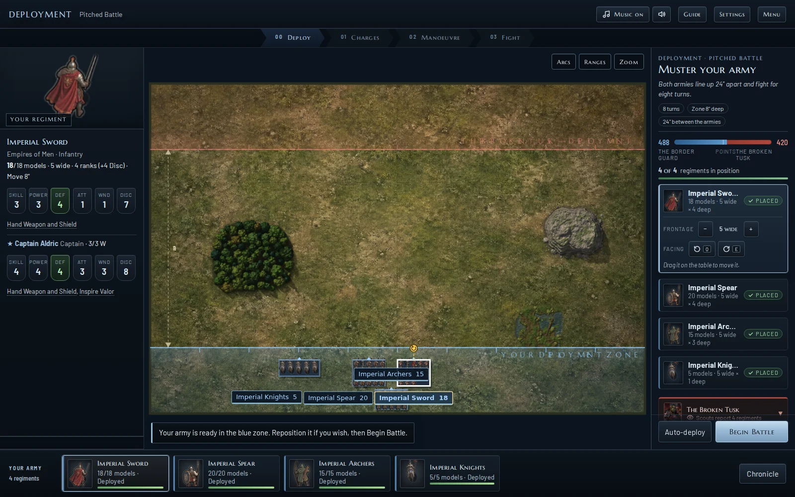
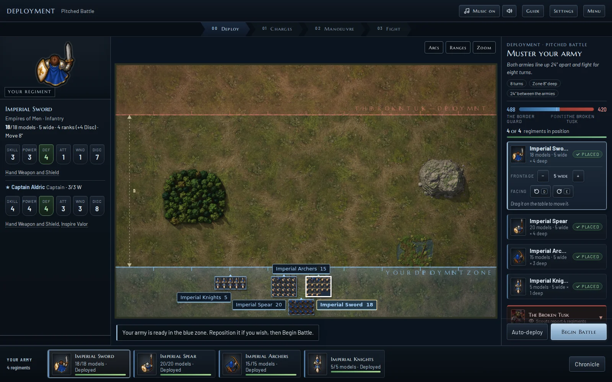
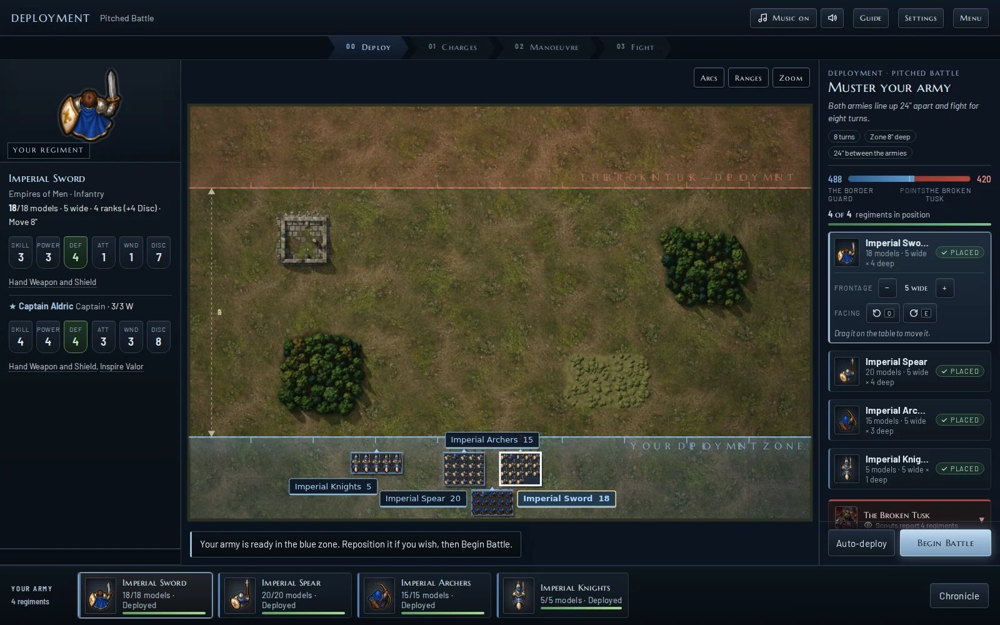
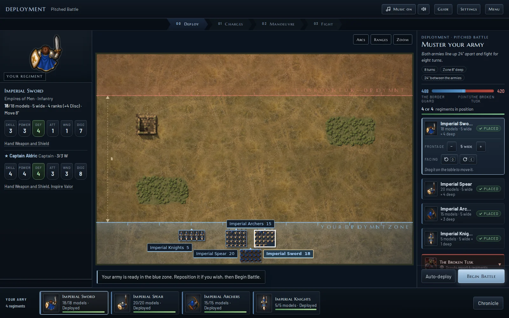
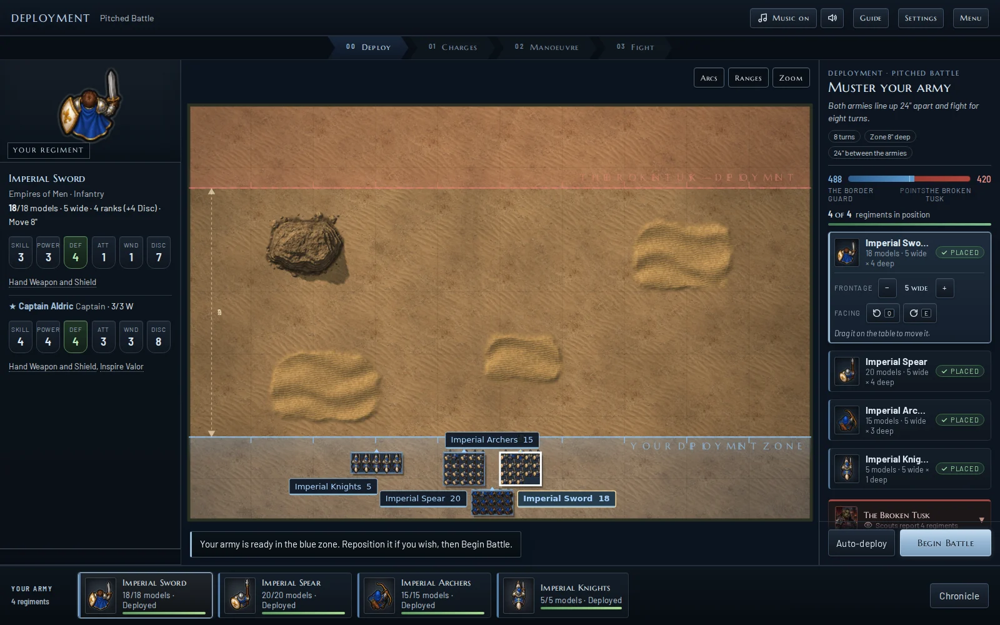
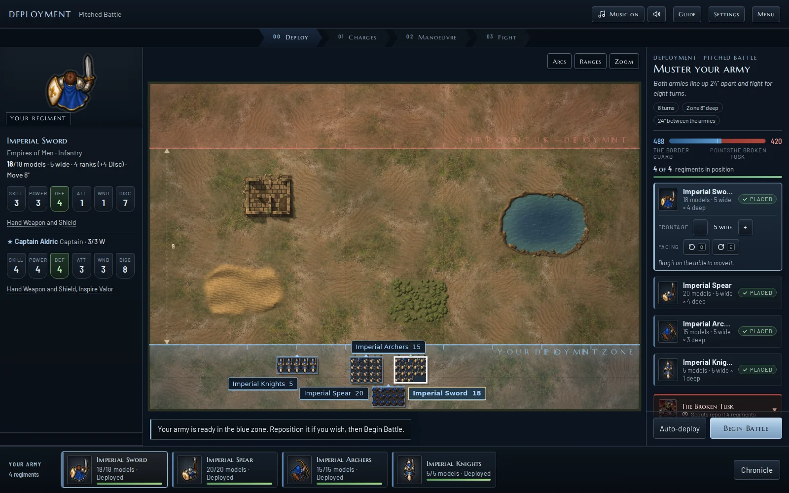
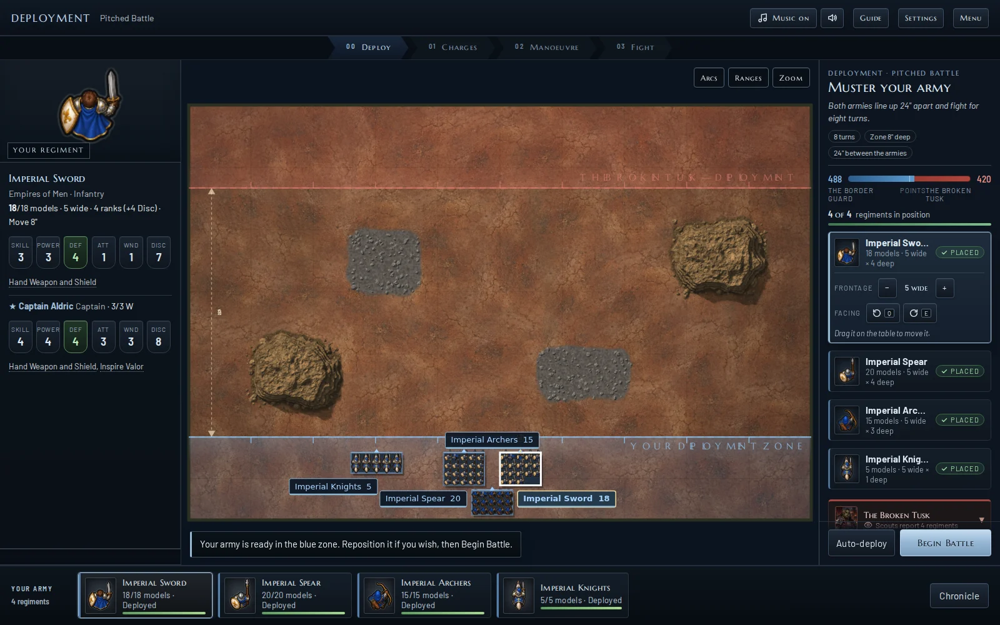
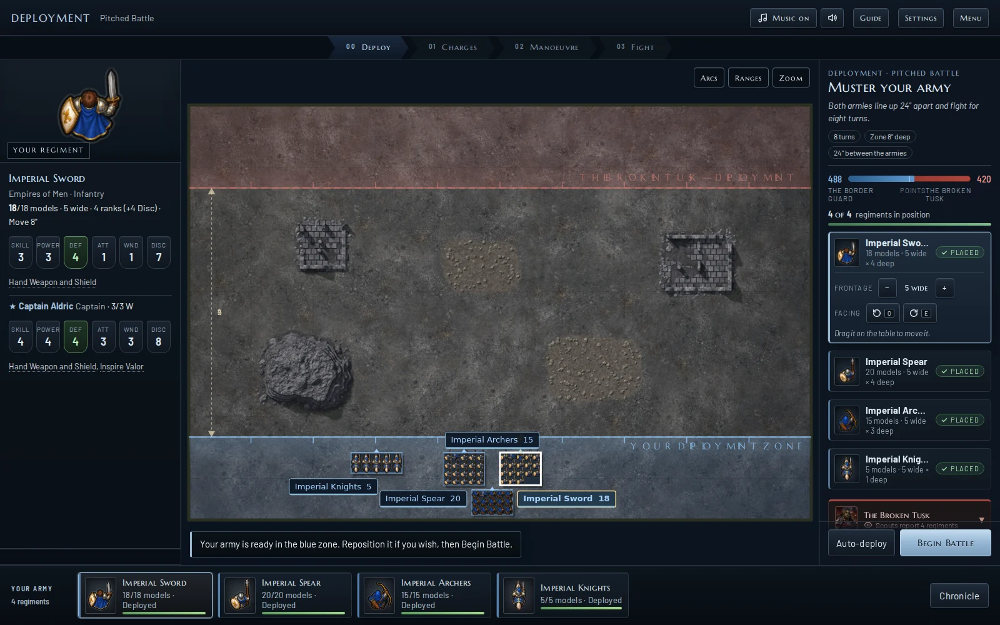

# Sprite and battlefield visual review

The old figures used tall, muted portraits in an overhead battlefield. This revision replaces all **81 faction/unit definitions** with dedicated compact, high-contrast artwork across five atlases. Each faction also has matching command and standard-bearer art.

## Before and after

The same prepared battle, viewport and deployment positions:

| Before | After |
| --- | --- |
|  |  |

[Inspect the final close-up](visual-review/after-close.webp).

## Review and refinements

1. Generated a complete first set with silver highlights, dark contours, clear weapons and distinct faction cloth: blue, copper/ochre, teal, crimson and violet.
2. Reviewed every source sheet, then regenerated all five with shorter overhead bodies and more consistent facing. Packed alpha-connected figures into separate padded cells, preserving weapons and wings even where a generated figure extended beyond the nominal grid.
3. Checked actual game screenshots. Adjusted infantry size and foot alignment so bodies stay within their ranks while weapons can project forward. Reduced idle pose jitter and the pale outline wash. Reused authored sprites across rank and facing cache keys.
4. Found oversized leaf/gravel textures at close zoom. Replaced the full-field stretch with miniature-scale patches. A second review caught mirrored repetition; the final version uses overlapping feathered patches with seeded variation.
5. Added grass blades, litter, grit, sand marks, faint wheel ruts and terrain-edge dressing to all six environments. Added finer dune relief and removed green moss from dry and volcanic rocks.
6. Found labels covering neighbouring formations. Label placement now reserves each visible regiment's rotated footprint as well as existing labels.

## Complete roster inspection

Each sheet shows every faction definition at inspection size and a 20px reference. Art is also used by the army builder, roster and selected-unit portrait.

| Faction | All definitions | Formations at four facings |
| --- | --- | --- |
| Empires of Men | [17 definitions](visual-review/roster-empires_of_men.webp) | [Infantry, cavalry, dragon](visual-review/formation-empires_of_men.webp) |
| Dwarf Holds | [16 definitions](visual-review/roster-dwarf_holds.webp) | [Warriors, crossbows, berserkers, cannon](visual-review/formation-dwarf_holds.webp) |
| Elven Conclaves | [16 definitions](visual-review/roster-elven_conclaves.webp) | [Spears, bows, dragon knights, dragon](visual-review/formation-elven_conclaves.webp) |
| Greenskin Tribes | [17 definitions](visual-review/roster-greenskin_tribes.webp) | [Orcs, goblins, boars, trolls](visual-review/formation-greenskin_tribes.webp) |
| Dead Nations | [15 definitions](visual-review/roster-dead_nations.webp) | [Skeletons, bows, cavalry, dragon](visual-review/formation-dead_nations.webp) |

The formation panels use `Renderer.drawUnit`, including the real sprite cache and regiment compositing. They are not arrangements of separate mockup illustrations.

## Battlefield inspection

| Borderlands | Plains | Desert |
| --- | --- | --- |
|  |  |  |

| Oasis | Badlands | Ashlands |
| --- | --- | --- |
|  |  |  |

Ground is baked to 1800 × 1200 and cached with a six-entry limit. Its decorative texture does not add obstacles or change the terrain footprints. [Mobile check](visual-review/mobile.webp).

## Validation

- Browser: all 81 definitions resolve to loaded, nonempty sprite rectangles; no page errors or failed asset requests.
- Visual inspection: all five complete rosters; 20 representative formations at four facings; desktop fit and 2.5× zoom; all six environments; 390px mobile layout.
- Regression: labels avoid formation footprints; repeated ground requests reuse the cache and do not mutate terrain state.
- Existing tactical suite: 20 battles, 149 manual engagements, 538 phase/integrity checks passed.
- Existing expansion suite: 3,330 reward, save, terrain and sound checks passed.
- Seeded simulation: 10 additional battles across all five factions passed.

Run `CHROMIUM_PATH=/path/to/chromium node test/visual-art.js /tmp/fantasy-art-review` with Playwright available. The test starts its own static server. Run `node test/tactical.js`, `node test/expansion.js`, and `node test/sim.js 10 20261007` for the engine checks.

## Asset maintenance

Original art was made with the built-in image-generation tool. Exact prompt briefs and revision prompts are in [assets/art-prompts.json](../assets/art-prompts.json). `tools/pack-unit-atlas.cjs` prepares a generated 5 × 4 source sheet, preserves alpha, writes its WebP and JSON bounds, and updates the runtime manifest. It requires Sharp. Example: `node tools/pack-unit-atlas.cjs source.png empire`.

These are static base poses. Existing movement/combat transforms provide motion; equipment options continue to use the named unit or its existing nearest weapon match. Tiny fit-to-table models show silhouette and faction colour; zooming and the selected-unit portrait provide inspection detail.
